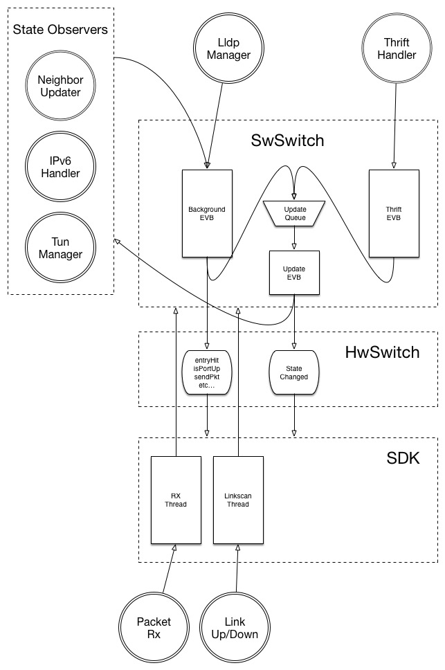

# FBOSS Concurrency Model
---
This page maps out the overall concurrency model of FBOSS. It should
help newcomers understand the FBOSS concurrency model at a high
level. As FBOSS grows, we (or open source contributors) will want to
implement more and more features on top of FBOSS. Implementers should
not have to think too hard about the subtleties of how we handle
concurrency and be able to focus on the features
themselves. Furthermore, these new features should be increasingly
isolated from the core `SwSwitch` code. This will allow our codebase
to scale in a loosely coupled manner that will be easier to manage.

## High-Level Diagram
===

### Key
* Rectangles are Threads/EventBases
* Circles are classes that create asynchronous events (or just an asynchronous event)
* Trapezoid is a queue.
* Bulgy hourglass thing is a function or group of functions.

### Note
1. I know it is a little weird that I have arrows from
classes/functions into threads and then from threads to other
components. Read that as a class running a function on that eventbase
that may call in to some other component.
2. The diagram above is a mostly accurate, but highly abstracted
representation of how the components of FBOSS fit together with
regards to concurrency as of 5/5/15. The one inaccuracy is that the
Thrift EVB is not technically managed by the `SwSwitch`, though I put
it in because I think it should be going forward.

## Managing State
---

### In SwSwitch
The
[`SwitchState`](https://github.com/facebook/fboss/blob/master/fboss/agent/doc/SwitchState.md)
class is a great abstraction we use to manage the `SwSwitch` state and
communicate changes to the `HwSwitch`. It is modeled as a
copy-on-write tree and is versioned (click the link for a detailed
explanation). The concurrency model for this state is simple–all
modifications to the state must be on the update eventbase. We
implement this by having every update to the state be abstracted into
a function that will be run on the updateThread. The update queue in
the above diagram is a queue that handles pending update functions and
schedules them on the update eventbase. After an update is processed
it is then communicated to the `HwSwitch` implementation and then all
state observers via the
[`StateDelta`](https://github.com/facebook/fboss/blob/master/fboss/agent/state/StateDelta.h)
class.

### In BcmSwitch
For the `BcmSwitch`, there are a set of state classes—`BcmPortTable`,
`BcmHostTable`, `BcmEgressTable` etc. that together reflect our idea
of what the state is inside of the sdk. We are currently not very
disciplined about reusing code or being intelligent about concurrency
for this state. Until recently, the implementation relied on locking
provided by `SwSwitch` around all calls to `HwSwitch`. Now, the
`BcmSwitch` manages its own locking, though we simply lock at most
entry points to the class. For now, it is probably good that we lock
conservatively, as this makes sure that no state is read while a
`StateDelta` is being processed by `stateChanged`.

### In the Broadcom SDK
The Broadcom SDK manages state that is used to actually program the
ASIC. The entire purpose of the `BcmSwitch` implementation is to
translate the platform-agnostic `SwitchState` object into platform
specific calls. The SDK has a ton of tables and registers, though most
of what we care about are objects that have corresponding
representation in the `BcmSwitch`--egress table, host table, port
table etc. Luckily, the SDK manages it's own concurrency and locks
around its state so we should not have to worry about races here 99%
of the time.

### In new sw components (NeighborUpdater etc.)
Some components of FBOSS will manage additional software state. The
reasoning here is that the `SwitchState` should encompass only what is
actually needed to program the hardware and not more. There is a
decent amount of overhead for every `SwitchState` change--scheduling
the update, creating the delta, notifying hardware + observers,
replacing SwitchState nodes. If a component has state that is only
interesting to that component (and is not useful for the `HwSwitch` to
know), it should manage that state separately. An example is when the
`NeighborUpdater` stores the age of a `NeighborEntry` and whether that
entry is stale or not.

Having additional state that complements the `SwitchState` leads to
more questions about how to manage this state in tandem with the
`SwitchState`. This will likely need to be evaluated on a case by case
basis, but I'll share my experience with `NeighborUpdater` for
context. My first draft of `NeighborUpdater` still treated the
`SwitchState` as the source of truth and tried to keep internal data
structures up to date whenever there was a `SwitchState` change. For
example, I stored a map from `IPAddresses` to the last time the arp
entry for that `IPAddress` was hit in hardware. This was used to make
decisions about expiring entries, but also meant that I had to listen
for added and deleted arp entries in `SwitchState`. Populating the map
also meant periodically probing the `HwSwitch` and the map would also
create state updates to expire entries. This led to a number of
concurrency issues and was ultimately difficult to manage.

My new draft (diffs pending) flips this around and creates a
`NeighborCache` structure that is the source of truth for all state
related to neighbor entries. This knows how to program the
`SwitchState` based on the contents of the `NeighborCache`. The
`NeighborCache` is stored by the `NeighborUpdater` and all events that
could cause a modification to the Arp/Ndp state are now handled by the
`NeighborUpdater` and used to modify the `NeighborCache`. This model
seems to be a definite improvement as there is no intricate dance with
the `SwitchState` to keep the internal structures
up-to-date. `NeighborUpdater` is still a `StateObserver`, but it only
listens for added/removed vlans now.

## Events & EventBases
---
FBOSS makes heavy use of libevent for concurrency. Specifically, we
use folly's
[`EventBase`](https://github.com/facebook/folly/blob/master/folly/io/async/EventBase.h)
which wraps libevent to provide a more OO interface and additional
functionality like queueing. The main threads in `SwSwitch` are the
update EventBase and the background EventBase.

### Update EventBase
The purpose of the UpdateEVB is to process updates to the
`SwitchState` and hw. The reason an entire thread is reserved for
updates is that a given update may go as far as actually modifying the
ASIC hw, so keeping other tasks from polluting this EventBase is a
must. We should always strive to minimize the amount being done on the
UpdateEVB to keep it clear for applying updates. Note that this thread
is also used to notify any classes observing the `SwitchState` of
changes. Even though the classes receive the update via the update
EventBase they should still strive to do as little work as possible on
the UpdateEVB by moving computation to the background EVB.

### Background EventBase
The BackgroundEVB should be used for processing all other software
events generated by `SwSwitch` components. In practice, this turns out
to be mostly asynchronous timeouts for classes that schedule tasks
periodically (see
[IPv6RouteAdvertiser.cpp](https://github.com/facebook/fboss/blob/master/fboss/agent/ndp/IPv6RouteAdvertiser.h)
for an example). Since the BackgroundEVB is provided to multiple
classes as a means to run asynchronous events, there needs to be some
level of co-ordination between `SwSwitch` and these classes,
especially on shutdown.

### Thrift EventBase
We currently create an EventBase in Main.cpp and create a ThriftServer
from that. This handles all thrift requests that can be made to the
agent. Most of the thrift calls only read state, but a few actually
modify it. We need to take care to make sure that we avoid races with
thrift calls. This is done by taking advantage of the fact that the
`SwitchState` is copy-on-write and thus reads are always valid and
don't require locking. Modifying thrift calls are usually implemented
synchronously.

### Events
The diagram above is best understood in terms of events. Each circle
around the outside can be thought of as where the event originates. We
have packets and linkstate updates coming in in the ASIC, asynchronous
timeouts from some `SwSwitch` components (`LldpManager`,
`NeighborUpdater` etc..) and thrift calls. The diagram loosely shows
what thread/EventBase will process a given event. For example, a
Packet Rx event will be received on the RX Thread in the broadcom
sdk. It will then be proxied through the `BcmSwitch` and into the
`SwSwitch`, still on the Rx thread. The NeighborUpdater timeout event
is processed on the BackgroundEVB. During processing we may add
updates to the update queue to remove pending entries or add/delete
entries, or call into the HwSwitch to check if a neighbor entry is hit
or to send a packet.
