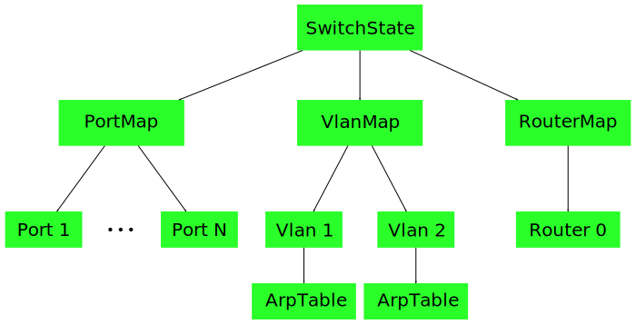

SwitchState
===========

The `SwitchState` class stores the entire state for the switch.  This contains
both static configuration information read from the configuration file, as well
as more dynamic information, such as ARP entries learned from the network and
routes learned from routing protocols such as BGP.

Tree Structure
==============

The `SwitchState` can be thought of as a tree.  The root of the tree is the
`SwitchState` object itself.

The `SwitchState` contains other configuration nodes, such as PortMap, VlanMap,
RouterMap, etc.  Each of these nodes can in turn contain other nodes.  (For
instance, VlanMap contains a list of VLANs, each of which can in turn contains
an ArpTable containing ArpEntries.)

Copy-on-Write
=============

The `SwitchState` object is updated in a copy-on-write fashion.  When a node
needs to be updated, rather than updating it in place, a new copy of the node
is made.  The node's parent also needs to be updated to point to the new node,
so a copy of the parent is made.  This continues all the way up to the root of
the tree.

In this simplified example, VLAN 2's ArpTable was modified.  A new copy of the
table was created.  This requires a new copy of Vlan2 to point at the new
ArpTable, a new VlanMap, and a new `SwitchState`.  A new copy of the modified
object was created, as well as all of its parents, but the rest of the tree
remains the same.  For instance, the new VlanMap still points at the old,
unchanged version of Vlan1.

Note that whenever any part of the state changes, a new `SwitchState` object is
always created, as it is the root of the tree.  After each change, the
`SwSwitch` object is updated to point to the current `SwitchState`.

Similar Systems
---------------

This copy-on-write mechanism is similar to a variety of other systems.  If you
are familiar with git or mercurial, this is very similar to the way that these
revision control systems store and modify their directory tree DAG.  If you are
familiar with ZFS or btrfs, this is similar to the way these file systems store
and manage their block tree.  The underlying copy-on-write mechanism is the
same in all of these systems.

Rationale
=========

Advantages
----------

* Concurrency

    This design simplifies concurrency greatly.  Because each `SwitchState`
    object is read-only, and never modified after it is created, multiple
    threads can access a `SwitchState` object simultaneously with no locking.

    Synchronization is needed to get the current `SwitchState` object from the
    `SwSwitch`, but once retrieved it can be accessed with no locking.  Note
    that after the current `SwitchState` is retrieved, the `SwSwitch` may be
    updated to point to a newer `SwitchState`.

    Callers that wish to avoid this can also hold the update lock if they wish
    to prevent the state from being updated while performing a particular
    operation.  However, it is expected that most callers won't need to do
    this.  For instance, when a trapped packet is received, it can be processed
    by the state when it was first received.  If the state is changed in
    another thread partway through packet processing, we don't need to restart
    processing with the new configuration, or delay the new configuration from
    taking effect.

* Easy, Efficient Diffs

    This design makes it very easy to take diffs between states.  Whenever the
    state is updated, we always have a pointer to the previous `SwitchState`
    object as well as the new `SwitchState` object.

    We can iterate through the two `SwitchState` trees to find the differences
    between them.  Since unchanged portions of the tree point at the exact same
    node objects, this allows us to easily skip over subtrees that are
    unchanged.  For instance, in the ArpTable example above, neither the
    PortMap nor RouterMap objects have changed.  We can see that both
    SwitchStates share the exact same objects for these subtrees, and we don't
    need to iterate down into these subtrees.

* Validation

    Because we build a new `SwitchState` object first, before making it take
    effect, we can also perform additional state validation before making it
    take effect.

    If we instead pushed changes down to hardware as we processed them, we
    would need to have a robust rollback mechanism if we found a problem
    partway through applying a change.

* Simple `HwSwitch` API

    `SwitchState` helps us provide a very simple, generic `HwSwitch` API.
    `HwSwitch` only contains a single method for pushing new state down into
    hardware.  The `stateChanged()` method takes a single StateDelta argument,
    which lists the previous `SwitchState` and the new `SwitchState`.

    The `HwSwitch` code can decide how to best apply this delta to the
    hardware.  This API is very generic, and makes no assumptions about the
    underlying hardware implementation.  Regardless of the API provided by the
    underlying hardware, it should be possible to create a `HwSwitch`
    implementation that translates the StateDelta to the right format needed by
    the hardware.

* Non-disruptive Restart

    This `SwitchState` also provides a straightforward way for implementing
    non-disruptive restarts of the controller, when supported by the hardware.

    When it first starts, the `HwSwitch` can introspect the hardware state (or
    recover state from a persistent log file), and build a `SwitchState` object
    representing the current state.  The `SwSwitch` can then build a
    `SwitchState` object representing the desired state based on its
    configuration file.  The desired state can then be applied to hardware
    using the normal `stateChanged()` API, just like any other StateDelta.

* State Transition Log

    The tree-like nature of `SwitchState` should also make it easy to take a
    `SwitchState` and serialize it to disk.  The copy-on-write update mechanism
    should make it easy to store a copy of the state on each change (or on
    every Nth change, or at periodic intervals).  This would provide a detailed
    transition log, allowing us to debug problems after the fact and
    reconstruct exactly how a switch arrived at its current configuration.

    This mechanism may be too expensive to enable all of the time, but it could
    be enabled on a handful of switches, or it could be enabled on demand when
    debugging a problem.

Disadvantages
-------------

* Complicated `HwSwitch` Implementation

    While the `HwSwitch` API is simple, figuring out how to actually apply a
    StateDelta may be complicated.

    We aim to provide helper functions that can be shared by many `HwSwitch`
    implementations.  However, the process of applying a StateDelta to hardware
    may end up being a fairly tricky piece of code, with many subtle corner
    cases and ordering issues.

* Performance

    Creating a new `SwitchState` copy for each modification may turn out to be
    expensive.  Several memory allocations will be required to create new
    versions of each node all the way up the tree.

    Additionally, walking a StateDelta to see exactly what has changed may also
    prove slightly expensive in some cases.  In general, diffing a StateDelta
    should be relatively cheap since we can quickly detect unchanged subtrees.
    However, for nodes with very large fan-out, it may be expensive to walk all
    children and determine which one(s) changed.

    We will need to see if performance turns out to to be a legitimate issue as
    we expand the `SwitchState` tree and make more use of it in large
    configurations.  However, I am not too concerned about this yet.  The cost
    of modifying our in-memory state may be outweighed by the time taken to
    actually apply the change to hardware.

    Furthermore, there are several tactics that we can use to improve
    performance if we find it becomes an issue in practice:

    * Allow in-place modification of some state

        If certain parts of the state change very rapidly, to the extent that
        the copy-on-write mechanism is too expensive to use, we can always
        allow changing specific pieces of the tree in place.

        This will require locks around these particular portions of the tree.
        It will also mean that updates to these portions of the tree need to be
        conveyed to the `HwSwitch` via dedicated APIs, rather than using the
        normal `stateChanged()` API.

    * Pass in hints along with the StateDelta

        If figuring out how to apply a StateDelta to hardware is expensive in
        some situations, we could also change the code to pass hints down to
        the `HwSwitch` in most cases.  For example, if a new route is added, we
        can call `stateChanged()` with the StateDelta, but also some additional
        arguments pointing to exactly the one route that was added.

        The `HwSwitch` code will still need to support applying a StateDelta
        without any hints (particularly for non-disruptive restart).  However,
        in most cases we should be able to provide additional arguments
        indicating what changed, so that the `HwSwitch` does not have to perform
        a full diff in most cases.

* No sibling or parent pointers

    Due to the way the copy-on-write mechanism works, nodes may only maintain
    pointers to their children.  A node cannot maintain a back pointer to its
    parent, or to other sibling nodes in the tree.

    This is because a nodes parent may change over time.  Multiple generations
    of the `SwitchState` may exist simultaneously, and the node may be used by
    several generations, with a different parent node in each.  For instance,
    in the ArpTable example above, Vlan2 changed, so a new VlanMap was created.
    However, Vlan1 remained the same, so both the old and new VlanMap objects
    point to the same Vlan1 object.

    Therefore, when a node needs to refer to some other sibling node elsewhere
    in the state tree, it cannot point to the sibling node directly.  It must
    instead store a node ID or node name.  For instance, a Port object cannot
    point to the Vlan objects for the VLANs that it belongs to.  Instead, it
    can only store VLAN IDs.  Callers who need the Vlan objects must look up
    the Vlan object using the VLAN IDs, starting from the `SwitchState` object
    that they are currently using.

Ownership & Conflict Resolution
===============================

Several different parts of the code modify the SwitchState tree.  Therefore
different portions of tree are owned and maintained by different parts of the
code.  Currently, all of the following different mechanisms are used to update
different portions of the tree:

* Configuration file

    The configuration file controls things like port states, VLANs, and VLAN
    membership.  This data is relatively static, and is only updated when a new
    configuration file is loaded.

* Thrift APIs

    Various thrift APIs are exposed, and external callers can call methods to
    add or remove routes, and change other parts of the tree.

* SwSwitch

    The SwSwitch logic maintains and updates parts of the SwitchState that are
    learned dynamically from the network.  For instance, the ARP table is
    maintained by the SwSwitch based on ARP messages received from the network.
    We currently do not support the spanning tree protocol, but spanning tree
    port states would also need to be controlled by the SwSwitch.

At the moment, there is no overall formal mechanism to track how each part of
the tree is maintained.  It is up to the different parts of the code that
modify the tree to ensure that they do not conflict with other parts of the
code.  We may need to develop more formal mechanisms over time, however.

For now, some portions of the tree will need their own ownership models.  For
instance, we will need to distinguish static ARP entries from ones learned from
the network, and static routes specified in a config file from ones programmed
via thrift.  We are not yet planning a single ownership model for the entire
tree, however.

Publish Mechanism
=================

Although each `SwitchState` object is read-only after it has been built, there
still needs to be a mechanism to build a `SwitchState` object in the first
place.

To support this, `SwitchState` and each of the other nodes in the tree do
provide methods for updating the state in place.  However, these methods may
only be called while building a new `SwitchState` object, and should never be
used to modify the current `SwitchState`.

To enforce this requirement, each node in the state tree has a "published"
flag.  If set, this node has been published as part of the current
`SwitchState`, and is now visible to multiple threads.  Once a node has been
marked published, it can no longer be modified.  Methods that modify node data
in place check that the published flag is unset.  This ensures that the node is
only visible to the current thread, so no synchronization problems will be
caused if it is modified.

Memory Management
=================

All nodes in the `SwitchState` tree are managed by by `std::shared_ptr`.
`shared_ptr` serves to reference count each node, and delete it as soon as it
is unused.

When the `SwSwitch` is updated with a new `SwitchState`, other callers may
still be using the old `SwitchState` object.  Since these callers each have a
`shared_ptr` to the old `SwitchState`, it will remain in existence even though
it is no longer current and is no longer pointed to by the main `SwSwitch`
object.

The same process works for internal nodes.  Each node stores `shared_ptr`s to
its children nodes.  Multiple generations of `SwitchState` objects may all
share the same child node.  `shared_ptr` will serve as a reference count
for the child node, and will ensure that the child node is deleted when it is
no longer used by any of the remaining `SwitchState` objects.
