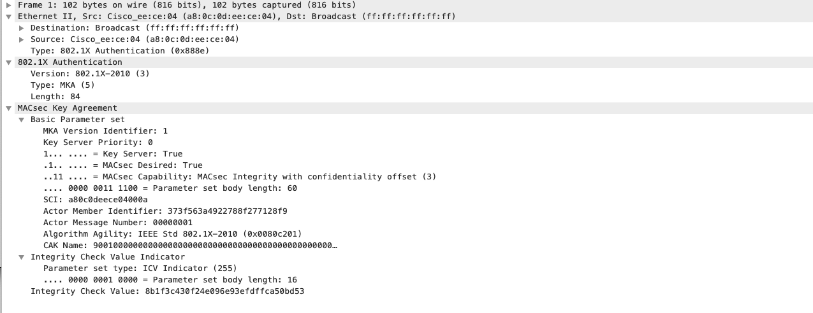
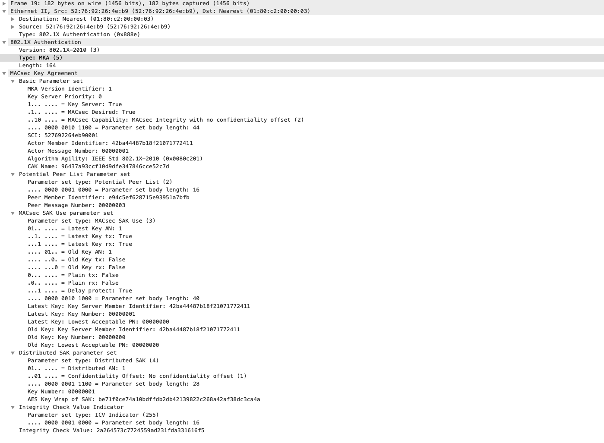
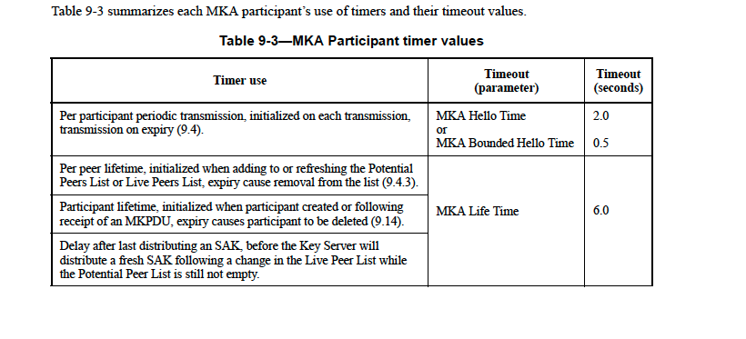
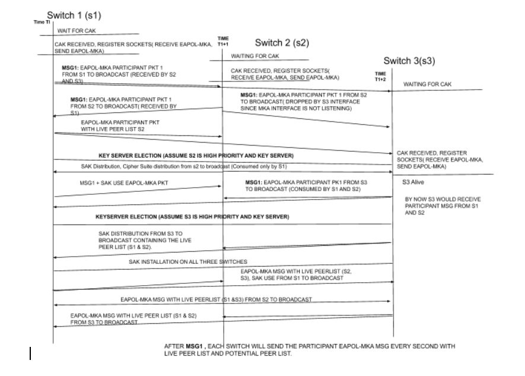

MKA Service design
##########################

Overview 
--------
International Standard Organization has instituted several Ethernet security 
standards such as IEEE 802.1AE and IEEE 802.1AF. MACSec is a layer 2 encryption. 
MACSec does not directly address how keys are obtained for encryption. MACSec 
key Agreement (MKA) protocol detailed in IEEE STD 802.1X-2010, IEEE Standard 
for Local and Metropolitan Area Networks—Port-Based Network Access Control, 
defines how the keys are obtained for encryption. This documents captures the 
design and implementation detail of MKA protocol for FBOSS. 

Like all good protocols, MKA has its own TLA soup. Abbreviations below should help
navigating the doc

* MKA  MACSEC key agreement
* CAK  Connectivity association key
* CKN  Connectivity association name
* SAK  Secure association key
* KEK  Key encryption key
* ICK  Integrity check validation key
* ICV  Integrity check value
* MI  Member identifier
* MN  Member number

MKA Implementation
--------------------

CAK (Master Key) Provision
~~~~~~~~~~~~~~~~~~~~~~~~~~~~

MKA protocol doesn’t provide guidance on how the master key (pre-shared key) 
is provisioned to the entity. Connectivity Association Key (CAK), is a master secret 
key. FBOSS MKA would rely on external entity (key server) to provision the CAK & CKN. 
FBOSS MKAService will have a thrift interface program the CAK, CKN for each port. Once 
CAK & CKN are provisioned, MKA session establishment will start. The Key Encryption 
Key (KEK) & ICV (Integrity check validation key - ICK) are 256-bit keys derived from 
CAK using the AES Cipher in CMAC mode. The CAK is not used directly. The derived keys 
are tied to the identity of the CAK. The Key Server is responsible for generating 
and distributing MACSec SAKs, using AES Key Wrap.

MKA Establishment
~~~~~~~~~~~~~~~~~~

**STEP 1: CAK & CKN Distribution**: The possession of CAK (Connectivity Association Key) 
and CKN (Connectivity Association Key Name) is suitable proof that one is authorized to 
participate on a particular LAN. The MACSec Key Agreement (MKA) protocol allows member of 
a secure connectivity association (CA) or a potential CA to discover other members attached 
to the same LAN, to confirm mutual possession of a CAK, to agree the secret keys 
Secure Association Keys (SAKs) used by MACSec for symmetric shared key cryptography,
and to ensure that the data protected by MACSec has not been delayed. 

**STEP 2: Live Participant EAPoL MKA**: When the participant is connected to LAN, it will 
send a EAPoL MKA Live Participant message.  This EAPoL MKA message contains the Basic Parameter Set, 
CAK Name and Integrity Check Value (ICV). MKAService will send these packet every second till 
it finds another participant on the LAN. The packet will have SCI, MI and MN in Basic Parameter
The participant chooses a new MI if its current MI is already in use, as detected by either of the 
following:
a) Its presence in the MI field of a received MKPDU
b) Its use in the Live Peer List or Potential Peer List of a received MKPDU in combination with an MN
that is greater than that last transmitted by the participant.

**STEP 3: Key Server Election**: The MKA participant can assume either the role a Key server or a 
normal participant. When more than two participants are available in a LAN, the key server is determined 
by a process called as Key Server Election. As soon as the MKA participant is created, it send outs the 
live participant EAPoL MKA MKPDU with the encoded Key server priority (an 8-bit unit) (STEP 2). The 
participant’s keeps sending out these messages until it receives any other live participant message. As soon 
as it receives any, the participants with highest Key Server priority will be elected as the Key server.

**STEP 4: SAK Distribution:** Elected Key server has the following special responsibilities: 
 1) Deciding on the use of MACSec 
 2) Cipher suite selection 
 3) SAK generation and distribution
 4) SA Assignment

The key server will only distribute SAK when the principal actor MI is present in the Live Peer list.

**STEP 5: SAK Expiry**

When any one entity is unreachable, new SAK is negotiated and uses. The timeout for an entity is 

**STEP 6: SAK Rotation**

When we rotate SAK, the old SAK will still be in-use to make sure that the traffic is not destructed. 
First the new SAK is installed to receive traffic along with old SAK. When all the entities install 
the new SAK to receive traffic, then the new SAK is installed to transmit and receive traffic and the 
old SAK is removed.

Example of MKA Establishment in a LAN with 3 peer switches.

MKAService Design
------------------

Crypto module
~~~~~~~~~~~~~~

Crypto Module provides utility functions for the following operations

* Key Encryption Key using CAK
* ICV Key using CAK
* SAK using CAK
* RNG for MI
* SCI Generation
* ICV Generation
* AES Key Wrap for SAK

MKA Service Handler
~~~~~~~~~~~~~~~~~~~~

The service will expose a thrift interface to install CAK. When MKAService Starts, handler would 
take the port with argument. The service handler binds to thrift port and wait for CAK to be installed 
on the interface. Once CAK is received, MKAServiec handler passes this over to MKAModule

MKA Module
-----------

MKAMoule maintains a map of l2Port -> MKASession, for each l2 port on which a CAK has been configured.
MKAModule creates 2 thread pools
* IOThread pools (2 threads) - for pdu send, recieve
* CPU/Worker thread pool (1 thread) - for pdu processing, key server election, hardware programming.

Its extremely important to **NOT** queue any h/w programming or long compute work on IO thread pool threads.
Doing so, would cause us to miss sending PDUs in time, which then leads to a session flap. 

MKASession
-----------
Represents a MKA session for a l2 port. There are 2 main work items for a session
* Periodic PDU send, receive and health check (to prune expired peers). Done on IO thread
* Packet processing, Sak generation, rotation and key server election. Done on CPU/worker thread

MKAParticipant
---------------
TBD

Testing and qualification
--------------------------

We perform the following tests for MACSEC as part of link testing https://www.internalfb.com/code/fbsource/fbcode/fboss/agent/test/link_tests/MacsecTest.cpp

* MKA session establishment + SAK installation - https://fburl.com/code/pe7o18sm

