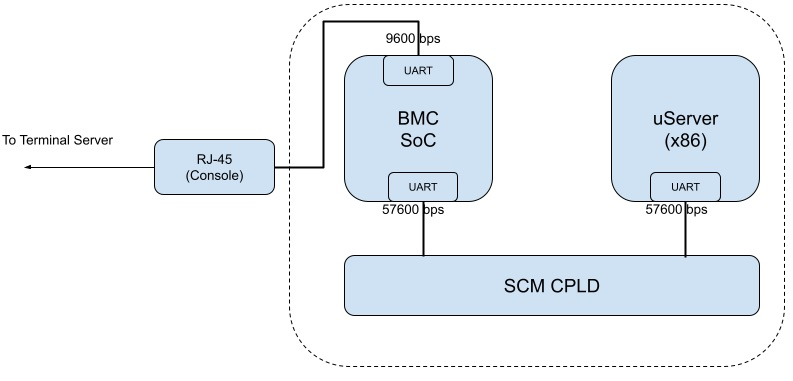
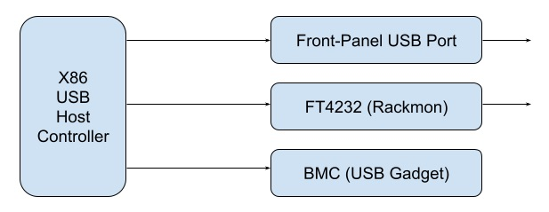
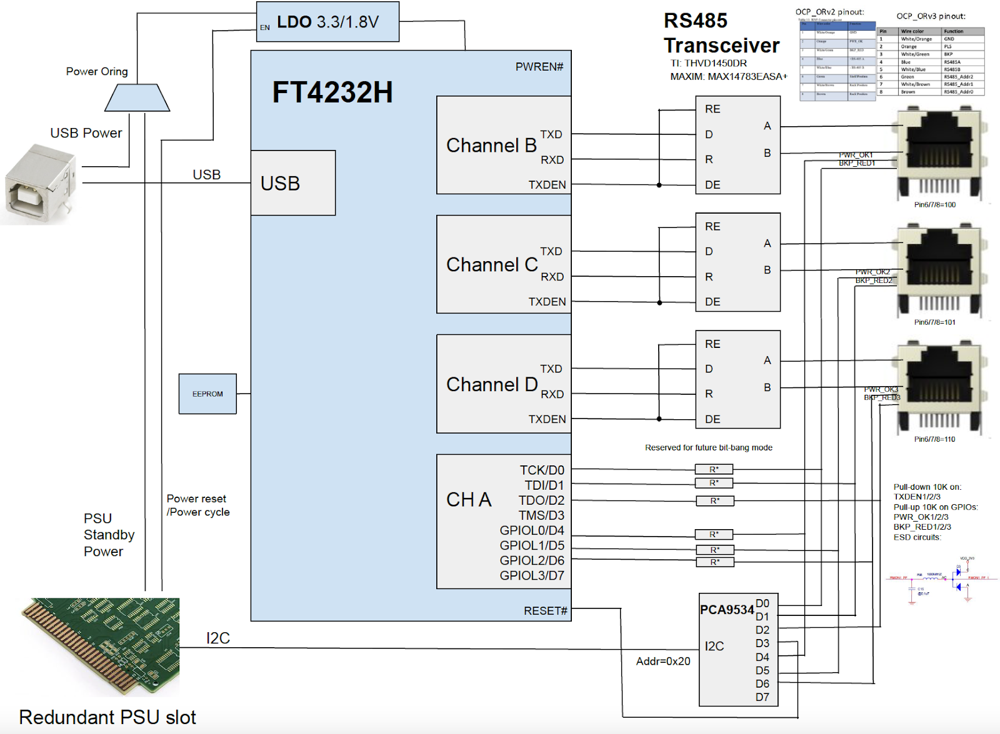

# FBOSS BMC-Lite System Requirement (SW and HW)

### Version 1.0.0


## Scope

This document captures requirements to the FBOSS BMC-Lite system, including
hardware architecture and system functions.

There are different levels of the requirements:

* Must Have (**MH**): The system must satisfy “must have” requirements. By
default, all requirements are “must have” unless they are explicitly specified
otherwise.
* Strong Desire (**SD**): The system must support “strong desire” requirements.
There is a clear timeline when the requirements will be fully supported, if it
is not supported yet. If the requirement is on HW and is not supported from HW
EVT, which phase of HW NPI with respin or not must be approved by the Meta.
* Wish List (**WL**): “Wish list” requirements are what Meta is evaluating. Any
limitation on the system to support this type of requirements shall be
explicitly stated by the system vendor.


## System Architecture


1. 1x x86 CPU + 1x BMC CPU
2. One console directly to BMC
3. One console from BMC directly to CPU
4. An embedded Gigabit Ethernet switch  to connect BMC and X86 to the
front-panel management ethernet port. Refer to section I-6 for details.

## Table of Contents
- [FBOSS BMC-Lite System Requirement (SW and HW)](#fboss-bmc-lite-system-requirement-sw-and-hw)
    - [Version 1.0.0](#version-100)
  - [Scope](#scope)
  - [System Architecture](#system-architecture)
  - [Table of Contents](#table-of-contents)
- [CHAPTER I : System Connectivity and Interfaces](#chapter-i--system-connectivity-and-interfaces)
  - [I-1. BMC (All MH)](#i-1-bmc-all-mh)
    - [HW Components](#hw-components)
    - [Functions](#functions)
  - [I-2. x86 CPU](#i-2-x86-cpu)
    - [Components](#components)
    - [Functions](#functions-1)
  - [I-3. System Control](#i-3-system-control)
  - [I-4. Allowed Recovery Paths (back-up paths)](#i-4-allowed-recovery-paths-back-up-paths)
  - [I-5. Console Connection](#i-5-console-connection)
  - [I-6. OOB Ethernet Connection](#i-6-oob-ethernet-connection)
  - [I-7. USB Connection](#i-7-usb-connection)
  - [I-8. Rackmon (For TOR switches only)](#i-8-rackmon-for-tor-switches-only)
  - [I-9. FRU Management](#i-9-fru-management)
- [CHAPTER II : SW and FW Requirements](#chapter-ii--sw-and-fw-requirements)
  - [II-1. x86 BIOS/Bootloader Requirements](#ii-1-x86-biosbootloader-requirements)
  - [II-2. BSP Requirements](#ii-2-bsp-requirements)
  - [II-3. User Level Platform Services Requirements](#ii-3-user-level-platform-services-requirements)
  - [II-4. OpenBMC Firmware Requirements](#ii-4-openbmc-firmware-requirements)
  - [II-5. Firmware Upgrade Requirements](#ii-5-firmware-upgrade-requirements)
  - [II-6. Partner Side SW Deliverable Schedule](#ii-6-partner-side-sw-deliverable-schedule)
  - [CHAPTER III : Provisioning Requirements](#chapter-iii--provisioning-requirements)
- [CHAPTER IV : System Security Requirements](#chapter-iv--system-security-requirements)
  - [IV-1. System Security](#iv-1-system-security)
- [CHAPTER V : Manufacturing and Integration](#chapter-v--manufacturing-and-integration)
  - [V-1. Integration requirement (For TOR switches only)](#v-1-integration-requirement-for-tor-switches-only)
- [References](#references)


# CHAPTER I : System Connectivity and Interfaces

## I-1. BMC (All MH)

### HW Components

1. **BMC SoC** (AST2620 or AST2600)
2. **BMC Memory** of 2G. (ECC must be enabled in u-boot.)
3. **Dual SPI flash**
    1. 2 x 128MB SPI flash chip, No QSPI.
    2. Alternate (2nd) Boot Recovery function should be enabled at manufacturing
    by strap OTP trap_en_bspiabr. The OTP bit can be programmed for 6 times, but
    it should be used only once during manufacturing, meaning still 5 times left.
4. **TPM 2.0**
    1. Please refer to Meta Platform Security Requirements [[2]](#2-meta-network-platform-security-requirements)
5. **eMMC**
    1. 8GB eMMC is recommended. **(SD)**
    2. The eMMC should support a secure way of  erasing contents.  Secure erase
    is usually done by the “trim/erase + sanitize” command, but it may vary
    depending on eMMC vendor and firmware versions. Other than this requirement,
    further questions shall be answered by the Meta HW engineering team. (**MH**
    if eMMC is present)


### Functions

1. **OpenBMC Watchdogs**
    1. Two watchdogs are used in the FBOSS OpenBMC, the primary watchdog WDT1
    and the dual_boot watchdog FMC_WDT2. Details as below:
        i. The primary watchdog (WDT1) is enabled by u-boot and later re-armed
        by Linux. The Linux kernel sets WDT1 timeout to 30 seconds, and a
        kthread is spawned to kick the watchdog periodically. This watchdog is
        used to reset OpenBMC when the system is stuck.
        ii. The dual_boot FMC_WDT2 is used to boot OpenBMC from the 2nd flash
        when the primary OpenBMC image is corrupted. FMC_WDT2 must be enabled by
        hardware strapping (OTP trap_en_bspiabr). When BMC is power cycled, the
        FMC_WDT2 is automatically enabled with 22 seconds timeout value; soon
        u-boot would re-arm the watchdog to 5 minutes, and the watchdog is
        disabled by “disable_watchdog” service at the late stage of OpenBMC
        bootup process.
2. **SEL**
    1. The system shall support SEL (System Event Log) from CPU to BMC over IPMI
    bus, unless we leverage previous design without LPC bus between CPU and BMC.
    The underlying HW bus will be :
        1. The IPMI messages are exchanged between BMC and X86 through LPC bus
        directly. eSPI will NOT be used (Recommended).
        2. BIC (Bridge-IC) shall not be used for IPMI communications.
        3. The ipmi-lite OpenBMC service is running to collect SEL from X86.
        Please refer to “Meta/OpenBMC Software Requirements” document for the
        software implementation details.


## I-2. x86 CPU


### Components


1. **X86 CPU** - Intel IceLake-D (four core or more). **(MH)**
2. **Memory** - 32GB or more **(MH)**
3. **SSD**
    1. 512G NVMe is preferred, though the minimum requirement is 256G NVMe is.
    **(MH)**
4. **FPGA and CPLD**
    1. The FPGA will control major system components. There can be multiple
    FPGAs and CPLDs.
    2. FPGA will be connected to CPU through PCIe **(MH)**
    3. CPLDs will be connected to CPU and BMC through I2C
    4. **Versioning :**
        1. FPGA and CPLD will have the version format of `<major>.<minor>`,
        for example 1.10 ; it is 2-tuple, and FPGA and CPLD driver will expose
        two sysfs nodes for the Major version and the Minor version,
        respectively.
            1. For example, Fan cpld driver will expose two sysfs nodes like:
                1. `/sys/bus/i2c/driver/fan_cpld/…/major_version`
                2. `/sys/bus/i2c/driver/fan_cpld/…/minor_version`
5. **Sensors**
    1. Types: temperature, voltage, power, current, fan
    2. Must connect through FPGA **(MH)**
6. **Fan and Fan Watchdog**
    1. Must connect through FPGA **(MH)**
    2. BMC does NOT need access to Fan CPLD. Instead, Fan CPLD will have a
    watchdog register; if the watchdog is not tamed for more than a specific
    period of time, Fan FPGA/CPLD will boost the PWM of all fans. Please refer
    to the “Fan Watchdog” section for details.
    3. Fan CPLD must run the fan fast enough at powerup, so that it can
    tolerate moderate to heavy ASIC usage. **(SD)**
7. **Sensors and power chips driver**
    1. By default, only the sensor and power-chips with already upstreamed
    Linux drivers should be used.
    2. If any vendor wants to use sensors, power-chips or any other device
    whose driver is not upstreamed, the vendor shall give the list of all such
    chips and get the approval form Meta.


### Functions

1. **System watchdog**
    1. System watchdog should be implemented in FPGA **(MH)**
    2. System watchdog should support the timeout threshold up to two hours
    (7200 seconds) **(MH)**
    3. The system watchdog must be disabled at power up by default. **(MH)**
    4. Upon the system watchdog timeout, FPGA will powe-rcycle X86 CPU only: BMC
    is not affected **(MH)**
2. **Fan Watchdog**

    Upon the Fan Watchdog timeout, the fans will be set to proper speed to
    prevent the switch from overheating. Below are the detailed requirements:

    1. **[MH]** FAN_CPLD_WATCHDOG_ENABLE register (default 0):
        1. 1 : enable watchdog
        2. 0 : disable
    2. **[WL (Note, not MH)]** FAN_CPLD_WATCHDOG_BOOST_PWM register (what value
    to set all pwms to, when watchdog expired)
        1. Default : A hardware specific value which should be high enough to
        sustain the system under the heavy traffic load, which ASIC gets very
        hot. An example value is 70% (if it’s 0 to 0xff range, 0xb0.)
    3. **[MH]** FAN_CPLD_WATCHDOG_COUNTER register (default value is 0, this
    register is 8bit wide or bigger) :
        1. The value decreases every 5 seconds. If we use this register as a way
        of “tickling” the watchdog. If we have a separate “tickling” register,
        this register only specifies the timeout value (5 sec x value of this
        register.)
        2. If the value is 0, and FAN_CPLD_WATCHDOG_ENABLE is set to 1 (that is,
        watchdog expired), FPGA will program all PWM with the value defined
        above (fan_cpld_watchdog_boost_pwm)
        3. Software will periodically write some value in this register for
        kicking the watchdog.
            * For example : SW writes `0xa` (=10) or similar value, and the
            counter decreases every 5 seconds, and the watchdog expires in 50
            seconds. Note that `0x10`, 5 seconds and 50 seconds expiration is
            just an example.
            * This will re-arm the watchdog and stop the FPGA from force-running
            the fan with the fixed PWM (the value of FAN_CPLD_WATCHDOG_BOOST_PWM)
    4. Note that the main CPU watchdog (when triggered) should not reset the
    values of the registers above. (That is, CPU reset caused by watchdog should
    not disarm the fan watchdog)
3. **System LED and Port LED**
    1. Access
        1. Access for both Port LEDs and System Status LEDs : The access path
        for SW should follow the requirements specified in Meta FBOSS BSP and
        Kernel Module Spec [[1]](#1-fboss-bsp-kernel-module-requirements-ver01)
    2. System Status LED
        1. System Status LED Behavior : The front-panel system LEDs and Port LED
        will follow the behavior defined in OCP Panel Indicator Specification [[5]](#5-ocp-panel-indicator-specification_rev10pdf)
        2. The front panel System Status LEDs (4 LED on the chassis) need to be
        controlled by FPGA, and if the FPGA system watchdog timeout, the SYS
        Status LED needs to be set to Amber by the FPGA, and it will remain
        Amber until X86 is up and LED is set by software again.
    3. Port Status LED
        1. Each QSFP, OSFP or SFP ports will have one LED per port, and should
        be able to support the following port LED behaviors controlled by FBOSS
        Software
            * No Optics Plugged In : No light.
            * Optics Plugged in but port not enabled : No Light
            * Port is enabled but link is down : No Light
            * Configuration Mismatch (Wrong cable connection) : Solid Green
            * Link is up at 100G speed : Solid Blue
            * Link is up at 200G speed : Solid Blue
            * Link is up at 400G speed : Solid Blue
            * Link is up at 800G speed : Solid Blue
            * Link is used via breakout cables : Solid Blue
            * Agent is starting (cold boot) : Blinking Blue
            * Agent is starting (warm boot) : Blinking Blue
4. **Module numbering scheme:**
    1. All module numbers are 1-based. That is, FAN1, FAN2, … and PSU1, PSU2,
    and so on
    2. The only important exception is that, PIM (if a system has multiple
    PIMS) will start from 2. That is, PIM2, PIM3, … and so on. This is because
    Meta will usually consider the SCM (or supervisor card) and the first module
    (slot 1.) Therefore PIM occupy slot 2, … and so on


## I-3. System Control

1. **Power**
    1. x86 CPU power-cycle : Both X86 CPU and BMC should be able to power-cycle
    the CPU **(MH)**
    2. Full system power-cycle : Both CPU and BMC should be able to power-cycle
    the entire system. **(MH)**
    3. OpenBMC `wedge_power.sh`  command is defined for power cycling/reset, and
    the command must support below arguments/options
        1. `wedge_power.sh status`. This command prints `Microserver power is
        on|off` to report CPU board power status.
        2. `wedge_power.sh on`. This command brings switching ASIC out of reset,
        powers on CPU and supplies power to all the QSFP ports. Note: this will
        also power on QSFP (optics) subsystem and Retimer/Gearbox subsystem. If
        they are already on, these will be no-op. For QSFP, “on” will not modify
        the “reset” state nor “low-power mode” state of each port.
        3. `wedge_power.sh off`. This command powers off the x86 CPU. Note that
        QSFP and Retimer/Gearbox will not be turned off. Note: components (FPGAs,
        CPLDs, EEPROMs, etc.) used by BMC should NOT lose power.
        4. wedge_power.sh reset: This command triggers the CPU hard reset signal
        to reset the CPU; Note that resetting the x86 CPU will also
        automatically reset switching ASIC and all the QSFP ports: switching
        ASIC needs to be out of reset when CPU is powered on, and QSFP ports
        will be powered but stay in reset mode (same with the state in
        `wedge_power.sh on`).
        5. `wedge_power.sh reset -s`: This command is to control the main power
        from PSU so that everything will get power cycled on main power except
        some minor circuits using standby power from PSU.
        6. `wedge_power.sh reset -s -t <time>` : It is NOT required to
        implement this -t logic in the hardware / software. (The option to use
        the timer logic around PSU to completely power-cycle the chassis after
        `<time>` seconds. This hardware circuitry and SW logic is NOT a
        requirement of BMC-Lite architecture.)
    4. `wedge_power` should **NOT finish until** the requested power sequencing
    is complete. For example, `wedge_power off` should not finish and return the
    return value until the power is completely off and the system is in such a
    state that it’s ready to power on right away once `wedge_power on` command
    is issued.
    5.
|                | Initial Power-on                                   | wedge_power.sh reset                                                            | "reset -s"                                    | "off"        | "on"              |
|----------------|----------------------------------------------------|---------------------------------------------------------------------------------|-----------------------------------------------|--------------|-------------------|
| x86            | off                                                | CPU hard reset signal is triggered. Note that CPU reset will also trigger ASIC. | Whole chassis power cycle as Initial Power-On | Powered off. | On                |
| BMC Sub-system | On                                                 | No change                                                                       | Whole chassis power cycle                     | No change    | No Change         |
| Switch ASIC    | Off (it will be turned on before CPU is turned on) | Toggle reset                                                                    | Whole chassis power cycle as Initial Power-On | No-op        | On (out of reset) |
| Optics/Retimer | No-op                                              | No-op                                                                           | Whole chassis power cycle as Initial Power-On | No-op        | No-op             |

    6. Initial power on state.
        1. After initial power-on , BMC sub-system must be powered on
        automatically with console and Ethernet funcion enabled. The OpenBMC
        power-on.service will power on the CPU board (CPU, ASIC and QSFP ports)
        at boot up time.
    7. `wedge_power.sh` command will be exposed only on BMC platforms. X86 CPU
    should still have a way to reset the system (thus be used by fan_service or
    other auto-remediation logic if needed), but it will not be exposed as a
    separate utility on x86.

2. FRU info
    1. The X86 CPU should have access to EEPROM information of **ALL**
    FRUs in the system, as the information is required for provisioning. **(MH)**
    2. The chassis EEPROM for X86 (containing platform type/name, etc) must be
    connected to the PCH/CPU-integrated I2C controller directly (not behind FPGA
    or any kinds of I2C MUXes).
    3. If a switch is modular, the EEPROM of each PIM should be directly
    connected to x86 CPU, and should not be through I2C MUX. It is OK for the
    PIM PPEROM is connected via a common FPGA
    4. BMC must have access to the platform identifications (product name,
    serial number, part number, asset tag, and versions), BMC MAC address and
    x86 MAC address. BMC must be able to fetch the information via I2C
    transactions (for example, `i2cget`) without depending on vendor BSP kernel
    modules (MH).
    5. BMC should have **I2C** access to the chassis EEPROM, as well as have a
    way to read x86 CPU’s MAC address, which is required for provisioning.
    6. BMC should be able to get the MAC address of X86 CPU and BMC itself.
    7. The BMC should have access to this information (CPU MAC address and all
    FRU into) regardless of X86 CPU state (powered on or off.) and vice versa.
    8. There should be **NO** caching mechanism to access the information source
    (HW) once and store it somewhere. All read/write should be directly from/on
    the actual devices that contain such information.

3. **SOL (Console)**
    1. BMC will have access to the CPU console. The detail is described in
    section I.5.

4. **OOB Switch (MH)**
    1. Refer to section I-6 for details.

5. **No exclusive resource access (MH)**
    1. In any part of the system, if a component or function can be accessed by
    both X86 CPU and BMC, such component should be accessible from both X86 CPU
    and BMC regardless of the state of X86 CPU and BMC.
    2. That is, BMC should have access to these resources even when X86 CPU is
    up and running without having to turn it off, and vice versa (X86 CPU should
    have access to the resources without having to take BMC down or up)
    3. It is recommended to use two different access points to the shared system
    resource to prevent bus contention. If that is not viable, the xDM vendor
    shall discuss the matter with the Meta SW team. **(MH)**
        1. More specifically, if a mux chip or mux through an FPGA has to be
        used, the mux should be controlled at least by BMC. Recommended that
        both CPU and BMC has the control.
        2. If two EEPROM of the same contents are used, for granting access to
        CPU and BMC simultaneously, these storage devices need to be on the same
        PCB.

6. **Optics Access - No I2C Mux (MH)**
    1. There should be no I2C Mux between Optics and FPGA (or CPU)
    2. This is because some I2C Mux connected directly to the optics may cause
    I2C access issue which required the reset of such I2C mux


## I-4. Allowed Recovery Paths (back-up paths)

**General Guidelines:**

* if a certain component (FPGAs, CPLDs, flashes, etc.) is corrupted and there is
no way to recover its firmware from X86, Meta will simply RMA the hardware.
* In order to mitigate the risks of RMA due to unrecoverable firmware, all the
“vulnerable” components must have a “golden” copy of firmware which can be
automatically loaded when the primary firmware is corrupted. The component is
considered “vulnerable” when
    * the failure of the component would prevent X86 from booting. For example,
    X86 BIOS.
    * Firmware upgrade and regular I/O share the same hardware path. For example,
    the IOB FPGA is considered “vulnerable” if firmware upgrade must be done
    through the PCIe data path.

Even though it’s very rare to have corrupted-but-unrecoverable firmware, we must
enable the OpenBMC backup recovery path for the following components, and the
major use cases are:

* recover critical components during NPI phases to speed up development.
* recover switches if more than 5% of the fleet are affected by corrupted
firmware.

OpenBMC backup recovery path are required for following components:

* X86 BIOS
    * The primary X86 BIOS flash chip must be connected to the BMC (ASPEED) SPI
    controller with MUX in between.
    * By default, the BIOS flash is disconnected from the BMC. In order to
    select the flash, OpenBMC must select the MUX by toggling GPIO lines, and
    the GPIO lines must be managed by the ASPEED GPIO controller directly.
    * The SPI bus is dedicated to the X86 BIOS (X86 BIOS doesn’t share the bus
    with any other SPI clients).
* IOB FPGA
    * If IOB FPGA firmware is corrupted, people won’t be able to recover it from
    X86 because firmware upgrade also goes through the data path (PCIe).
    * It is very rare to break IOB FPGA firmware thanks to the golden image, but
    the backup recovery path is required to speed up recovery in NPI phases.
* CPU CPLD
    * Similar to IOB FPGA, the backup recovery path is required to speed up the
    recovery process in NPI phases.

**OpenBMC Software Considerations:**

1. In order to minimize the chance of unexpected firmware access from OpenBMC,
the device driver for the backup recovery paths are not loaded by default. To
enable the backup recovery path, people need to run `service_mode.sh` in OpenBMC
explicitly.
2. There is NO recovery path from BMC to Fan CPLD. Instead Fan CPLD will boost
PWM once its own watchdog is triggered. The detail of this Fan CPLD watchdog
mechanism is specified in section [I.2](#i-2-x86-cpu).


## I-5. Console Connection



**As shown in the above diagram:**

1. The front panel console port must be connected to BMC, at 9600bps (8n1)
2. There will be one console connection from BMC to CPU, at 57600 bps (8n1)
3. The ASPEED “UART Debug Controller” feature must be disabled through HW
strapping pins due to security concerns.


## I-6. OOB Ethernet Connection

Below is the reference design of Out-of-Band Ethernet Connection in the BMC-lite
FBOSS Switches.


**Front Panel Management Ports:**

1. By default, two management ports (2 x RJ45) are required on the front panel
(unless specified by Meta). ~~By default, 2 management ports, per switch, are
required on the front panel, 1xRJ45 + 1x10G SFP+.~~
2. Only for platforms without an inband network (FDSW for now), a second 10G
SFP+ is required.
3. Any configuration required to support SFP+ module and Ether switch must not
require SW
    1. Rely on HW/FW/EEPROM.
4. For SFP+ port(s),
    2. support either 10G PtP or PON SFP+ modules
        1. Pending: PtP or PON, together with the list of modules to support is
        TBD.
    3. Must support 3.0W module from power and thermal perspectives.

**Internal Connections (among X86, BMC and Switch):**

1. 1G connection between BMC and switch.
2. 10G connection between X86 and switch.
3. The OOB switch must be configured through HW strap or EEPROM without
requiring Software from BMC or x86.
4. The OOB switch must provide a MDIO interface for configuration/management,
and the MDIO interface must be connected to the BMC MDIO controller.
5. The OOB switch must support multicast/broadcast CDP packets to all ports.
6. The OOB switch must be configured with 3 VLANs (if only one management port
exists, 2 VLANs can be used.)
    1. A default VLAN includes all ports used, x86 Ether, BMC ether, and Front
    Panel management ethernet ports.
        1. Any un-tagged network traffic belongs to this VLAN.
    2. A VLAN with tag 0xff8/4088 includes all ports **except** Front Panel
    management ethernet ports for the **second** management port.
    **(if the 2nd management port exists)**
    3. A VLAN with tag 0xffb/4092 includes all ports **except** Front Panel
    management ethernet ports for the **first** management port.
7. Any traffic, in/out front panel mgmt port (by BMC or x86), is expected to be
untagged. For example, traffic sent by iPXE from x86 shall be untagged.
8. For intra-chassis communication, between x86 and BMC (no front panel), tagged
traffic (4088 for the first management port, and 4092 for the second management
port) is expected.

**OOB Switch EEPROM:**

* The OOB switch EEPROM must be programmed with expected configurations at
manufacturing phase.
* The OOB switch EEPROM is connected to the OOB switch by default (at power
cycle).
* A mux is needed to allow the OOB switch EEPROM to be connected to the X86
SPI/I2C controller and programmed in the X86 Linux. The mux can be
selected/deselected by a single GPIO toggling.

NOTE: Please do NOT use NC-SI for OOB ethernet connection between BMC and X86.


## I-7. USB Connection



The uServer (X86) serves as the USB host in the FBOSS environment. The X86 USB
Host Controller provides connections to below 3 downstream ports and devices:

* The front panel USB port.
* The FT4232 USB-Serial adapter for rackmon. This path is only required for TOR
switches, and please refer to the I-8 “Rackmon” section for details.
* The USB path between X86 and BMC provides serial/ethernet-over-usb features.
BMC is the USB client (gadget).


## I-8. Rackmon (For TOR switches only)

1. **Rackmon HW (MH)**
    1. Any TOR switch used in Facebook data center should be equipped with
    Rackmond hardware that meets Facebook requirements
        1. Details : Here is overall ToR Rackmon implementation: **TBD**
        2. For OEM switches, since there is no BMC access to control Rackmon,
        they have to add this part of circuits in one of the PSU slots (the
        other PSU slot will be used for DC PEM):
        3. 
        4. With the diagram above, it’s going to be x86(uS) accessing the FTDI
        controller, and the GPIOs will go through the I2C bus (primary solution)
        or FTDI’s GPIO (backup solution).
    2. CPU should have access to Rackmon’s FTDI chip through USB connectivity.
    3. The baudrate of UART/RS485 need to support both low speed(19.2Kbps) and
    high speed (115.2Kbps).
    4. Each RJ45 needs to support 6-12 slave devices.


## I-9. FRU Management

FRU stands for Field Replaceable Unit, and it refers to the hardware modules
that can be swapped in the field. Below components must be FRUs in the FBOSS
switch:

* SCM
* SSD
* RunBMC
* FAN
* PEM or PSU

SMB doesn’t have to be field-replaceable. If it is a FRU:

1. When SMB is unplugged, both CPU and BMC should be powered down
2. When SMB is plugged back, the same power sequencing that Hardware (Power
sequencing CPLD or FPGA) does at system power up should happen again.

**1. FRU Monitoring**

* Each FRU must have its own FRU ID EEPROM.
* There must be a GPIO line to indicate the presence of each FRU.
* FRUs are monitored on the X86 side, which means:
    * The X86 CPU needs access to all the FRU IDPROMs.
    * The X86 CPU needs access to all the GPIO lines that indicate the presence
    of FRUs.

**2. FRU EEPROMs.**

* The Chassis EEPROM must contain BMC MAC address and switch MAC addresses.
* The number of switch MAC addresses should be equal or more than 
`NumTransceivers * NumBreakoutsPerTransceiver + 16`.  For example, if there
are 32 Transceivers and 4 breakouts suported by individual transceiver, then we
need 144 MAC Addresses (32 * 4 + 16). The extra 16 MAC addresses are for 
aggregated interfaces (LAG). 
* The Chassis EEPROM must be connected to the BMC/ASPEED I2C controller 
directly. Two copies of Chassis EEPROM are a must, since both BMC and x86 need 
access to the Chassis EEPROM.
* The SCM EEPROM must contain the X86 MAC address.
* The SCM EEPROM must be connected to the BMC/ASPEED I2C controller directly. 
Two copies of SCM EEPROM are a must, since both BMC and x86 need access to the 
SCM EEPROM.

**3. FRU EEPROM format/layout**

* All the FRU ID EEPROMs must follow the layout defined in the “Meta FBOSS
EEPROM Format” document.
* If vendor-defined EEPROM format must be used for some reasons, please:
    * Reach out to Meta team for approval
    * Include meta-style content at the beginning of the EEPROM, followed by the
    vendor-defined content (which implies the EEPROM must be big enough to hold
    both layouts).


# CHAPTER II : SW and FW Requirements


## II-1. x86 BIOS/Bootloader Requirements

1. Only support UEFI BIOS (prefered)  or Linuxboot (as 2nd option)
2. Serial baud rate must be set to 57600 bps by default
3. Secure boot (or any measured boot mechanism) must be disabled by default
4. BIOS must include all the required ACPI entries: installing additional ACPI
(ACPI_TABLE_UPGRADE) is NOT allowed.
5. BIOS must be downgradable too
6. Boot sequence:
    1. PXE IPv6 boot will always be the first choice
    2. Local SSD/flash is the 2nd choice
    3. USB flash drive is the 3rd choice (optional, disabled by default)
    4. Start from beginning again
7. Dmidecode : BIOS shall detect the system type, and fill out DMI so that users
be able to check the system type in Linux using dmidecode command. Example
follows:
    ```
    Handle 0x0001, DMI type 1, 27 bytes
    System Information
            Manufacturer: Intel
            Product Name: **Minipack3  **
            Version: To be filled by O.E.M.
            Serial Number: To be filled by O.E.M.
            UUID: Not Settable
            Wake-up Type: Other
            SKU Number: Default string
    ```


## II-2. BSP Requirements
References [[1]](#1-fboss-bsp-kernel-modul)[[4]](#4-meta-fboss-switch-platform-service-support-requirement)

1. **BSP API (MH)**
    1. What is BSP : BSP means “Board Service Package”, which is a set of SW
    APIs for accessing system resources. The xDM partner is responsible for
    providing Meta with BSP.
    2. Code repository by Meta: The partner shall check-in the BSP source code
    to a shared private repo created by Meta
    3. The partner shall provide the APIs and sysfs endpoints as specified in
    **“FBOSS:BSP Kernel Module Requirements”**[[1]](#1-fboss-bsp-kernel-modul)
    and **“Meta FBOSS Switch Platform Service Support Requirement”**[[4]](#4-meta-fboss-switch-platform-service-support-requirement)

    4. Note that kernel modules need to be loadable/unloadable stably. That is,
    kernel module should not fail during very frequent load / unload.
    5. Timing of BSP :
        1. The very first version of BSP should be delivered at least one month
        before the arrival of the first prototype to Meta.
        2. A newer version of BSP that fixes all issues during the initial
        bringup should be delivered to Meta by the end of EVT Exit
        3. A newer version of BSP that fixes all issues found during
        provisioning and DVT exit will be delivered to Meta by the end of DVT
        Exit
        4. The production version of BSP shall be delivered by PVT Exit
    6. `sensor_service` value: When Meta’s `sensor_service` receives the Thrift
    call/request, the service shall return the human readable metrics in float.
    That is, `sensor_service` will not adjust value by multiplying by 1000
    (12.1V - correct, 12100 mV - wrong)


## II-3. User Level Platform Services Requirements

Partners shall provide all the configurations for their platforms. The format of
the configuration files and the roles of partners are described in “Meta Switch
Platform Services Requirements"[[4]](#4-meta-fboss-switch-platform-service-support-requirement)

* These configuration files must be committed to a shared private repo that is
created by Meta (usually per partner, and not per platform)


## II-4. OpenBMC Firmware Requirements

Please refer to “Meta/OpenBMC Software Requirements” document, in addition to
the important requirement below :

* Code repository by Meta : The partner shall check-in the BSP source code to a
shared private repo created by Meta


## II-5. Firmware Upgrade Requirements

1. **Firmware Upgrade SW Utility**
2. **Open source upgrade utility will be used.**
    1. For example, flashrom.
        1. If hardware specific logic needs to be implemented, such logic will
        be implemented as either kernel module (exposing sysfs) or as an
        additional library that open source upgrade can easily use.
3. **Firmware Upgrade Path : Multiple upgrade paths needed.**
    1. **From the X86 CPU : Primary**
        1.  By default, the X86 CPU should be able to upgrade all the firmwares
        such as BIOS, FPGAs. CPLDs and eeproms (except for BMC image.)
        2. The CPU can get the help of FPGA or CPLD for upgrading these
        firmwares. (for example, SPI bus from FPGA)
    2. **From the BMC : Recovery Path (Back-up)**
        1. There should be hardware recovery path (back-up path) only to BIOS
        and SCM FPGA, because corrupted BIOS, SCM FPGA or any FPD (Field
        Programmable Device) that can take the CPU down. This is still true even
        when these programmables are capable of rolling back to golden image
        when primary images are corrupt. Golden images do not need to be
        upgraded. **(MH)**
        2. BMC image will be upgraded by BMC (both primary and golden) **(MH)**
    3. **Version Check**
        1. x86 CPU should have a way to get the current version of all BIOS,
        FPGA and CPLDs.
        2. BMC should have a way to get the current version of the BMC image.
    4. **ACPI load**
        1. All the necessary ACPI tables must be included in the BIOS:
        installing ACPI tables via initrd is Not allowed.
4. **Firmware Upgrade Utility : Check the document in footnote:** [[4]](#4-meta-fboss-switch-platform-service-support-requirement)
5. **When the new firmware will kick in :** It is OK for the new firmware to
kick in (load) after full system power cycle. (Until the system power cycle, the
old firmware will still be running)


## II-6. Partner Side SW Deliverable Schedule

* The vendors partners shall follow the SW deliverable schedule specified in the
partner SW deliverables schedule[[6]](#6-source-partner-sw-deliverables-schedule),
for all deliverables except for the ones whose schedule is explicitly defined in
this spec.  If the deliverables are in the form of PR (pull-request on Github),
the PR should follow the Meta PR request guidelines[[7]](#7-metaopenbmc-pull-request-guidelines-ver01)


## CHAPTER III : Provisioning Requirements

 **For provisioning requirements, refer to “Provisioning Requirements”**[[3]](#3-provisioning-requirements)

# CHAPTER IV : System Security Requirements


## IV-1. System Security

**The vendor will meet all the system security requirements defined in Meta’s
“Network Platform Security Requirements” documentation.**[[2]](#2-meta-network-platform-security-requirements)
Still, please note that :

* As of Aug 2023, Meta does not require the switch system to have PRoT (root of
trust device solution) on X86 side.
* As of Aug 2023, Meta does not require the BMC of the switch system to run
Verified Boot (or Secure Boot) any more.

# CHAPTER V : Manufacturing and Integration


## V-1. Integration requirement (For TOR switches only)

**1. Integrator testing requirements (MH)**

The rack switch needs to go through the integration process at Meta’s integrator
side. They also run rack level (L11) testing through Meta’s FAVA automation
framework. Rack switch vendors should support all the switch features/test items
which are required during the integration test. The testing items include:

* There should be console access to BMC, and sol.sh to redirect console from BMC
to CPU through the same physical RJ45 console port;
* Both BMC and CPU should have remote access (e.g. ssh) through Out-of-Band
network (the RJ45 management port), and support DHCP client (ipv4/ipv6).

There are some switch self-tests to run before the rack system level testing
(run iperf on all the nodes in the rack). The following is the list of tests
that needs to run:

*  Boot order (micro server): It uses the efibootmgr tool on the server to
verify that the boot order is what we expect (ipv4, ipv6, disk os, Built-in EFI
Shell etc.)
* Switch serial number check: It uses some system util to fetch the serial
number of the switch and compare it against the shop floor data to make sure it
matches.
* Memory check (micro server): It runs the memtester tool on the server and make
sure that the tool runs successfully (based on exit code)
* Dump the dmidecode values of the bios (micro server)
* Verify the fw version on the micro server against the BOM values: The ones we
check are BMC, BIOS, diag, ssd fw versions
* Port map verification: Using some utilities on the switch, we fetch the mac
address <-> port connection information and verify it against the  expected
value.(e.g. L2 MAC learning table show)
* At the integrator side, usually they have only 10G/40G uplink network in their
test environment. This requires switch vendors to provide the port config on
switch for both the uplinks and downlinks.
* Test PSU: Using some system utilities (e.g. rackmoninfo, rackmonstatus), we
check the manufacturing information of the power units on the system. The
information we check includes mfg date, mfg serial number. We also checked
against the expected number of psu units on the system.

Notes:

All the testing is done automatically with our in-house testing framework which
launches testing jobs on the switch and the results are displayed in some UI.
Some of these tests are run on the micro server while others are run on BMC. At
the start of the manufacturing testing of a rack, a switch configuration test is
launched against the switch to configure the switch for the mode applicable to
the hardware platform it is connected to. The test also runs any necessary
utility to make sure we have a working uplink that supports the cable type we
want to use (like fiber) as the switch is typically connected to another switch
so that our testing framework can manage testing of a number of racks at the
same time.

**2. GDCC requirements (SD)**

When the rack is landed in our DC and powered up (before FBOSS provisioning),
it’s expected to have all the uplink LED working with some pre-loaded
image/configuration on the switch before it’s shipped out from integrators if
different images are needed from the one that used for integration test. This
step also need to be added in the FAVA automation framework. When the system is
powered up in our DC, it needs to support:

* the switching ASIC been configured/initialized with correct uplink ports speed
config according to our DC’s uplink connections, and the LED on the front panel
to indicate the link up/down status, so GDCC team can confirm their cabling work
is done correctly, and make provisioning process smoothly;
* The uplink port speed needs automatic detection between 100G/200G and/or 400G
to cover multiple generation of fabric switches;
* All the features above need to be started automatically without any
touch/config/remote access of the switch.

# References
1: [FBOSS: BSP Kernel Module Requirements](./bsp_requirements.md)

2: [Meta Network Platform Security Requirements](./platform_security_requirements.md)

3: [Provisioning Requirements - NPI](./provisioning/provisioning_requirements_npi.md)

4: [Meta FBOSS Switch Platform Service Support Requirement](./services_support_requirements.md)

5: OCP Panel Indicator Specification - TBD

6: Partner SW Deliverables Schedule - Reach out to get access.

7: [Meta/OpenBMC Pull Request Guidelines](./openbmc_pr_guidelines.md)
