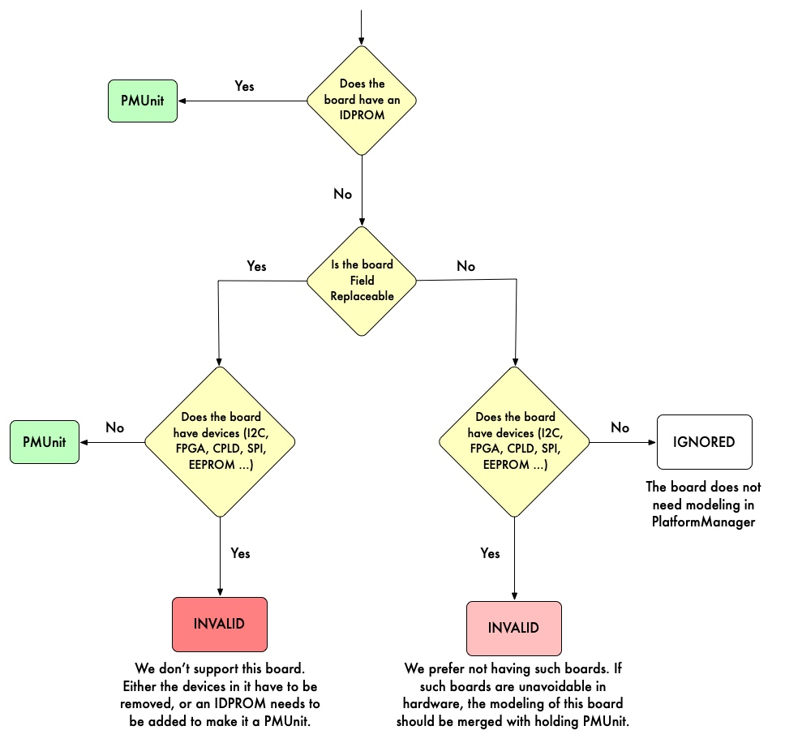

# PlatformManager

## Introduction

The objective of PlatformManager is to generalize low level device setup and
management across platforms. This avoids platform specific customized software
logic. All the Platform specific information should be encoded in configuration
files, and the same generic software should run on all platforms going forward.

## Functions of Interest:

- **Inventory Management**: A switch system could have different FRUs.
  PlatformManager is responsible for building the inventory of the FRUs in a
  switch. PlatformManager needs to monitor in real time what FRU has been
  removed or inserted into the switch. It provides an interface to software
  components within and outside of PlatformManager about the FRUs and the FRU
  EEPROM contents.
- **Dynamic Device Management**: When an FRU has been detected by the Inventory
  Management, Dynamic Device Management will load the necessary kmods and enable
  communication with the FRU. PlatformManager will also ensure that the FRU
  devices get consistent naming within each platform irrespective of how it is
  plugged in and across reboots.

## Components:

- **Platform Specific Configuration (provided by Vendors):** It has information
  about the FRUs, I2C devices and how they can be accessed. The configuration
  format is defined here. See here for a sample config.
- **Platform Agnostic Software (developed by Meta):** Meta will write and
  maintain the software. The source code is here.

## Workflow:

#### On Initialization

- Determine Platform Type using dmidecode set by BIOS. Details are in BMC Lite
  Specifications.
- Load the platform specific PlatformManager Config
- Discover the devices (by polling present registers or reading sysfs paths)
  based on the config and load the necessary kmods.

#### Periodically

- Detect devices by listening to present polling/interrupts (by polling for now,
  since interrupts are not full-fledged)
- On device detection, use the PlatformManager Config to set up the device and
  load the necessary kmods.

## Usage:

- PlatformManager will be used at provisioning/boot-up and be executed before
  any FRU/EEPROM/FW access.
- PlatformManager will be run in steady state of the switch to facilitate
  dynamic detection of devices.

## Vendor Expectations:

- Configuration: Vendor will provide the platform specific configuration
  according to the specification in fboss repository.
- Handoff: Vendor will run PlatformManager as part of the handoff. The running
  and testing instructions will be provided in fboss repository.
- PCI Device IDs: All PCI devices (e.g., FPGA) should have unique Vendor ID and
  Device ID in the PCI configuration space.
- Dmidecode Setup: The platform type should be obtainable through dmidecode, per
  BMC-lite specification document
- BSP: The BSP should follow the BSP requirements specification to enable device
  discovery and setup. We expect one set of kmods per vendor.

---

# Modeling Requirements

## PMUnit:

Unit used for modeling in PlatformManager. It typically matches with a FRU, but
not always. PMUnit and FRU terminologies are used interchangeably in this
document. PMUnit and FRU differences will be explicitly called out when they are
not interchangeable.

## EEPROM:

It should store content in Meta EEPROM V5 format.

## IDPROM:

- Any EEPROM which is used to identify the FRU/PMUnit type is called IDPROM.
- The IDPROM in the FRU MUST be connected in one of the following ways:
  - Directly to an incoming I2C bus from the parent FRU.
  - Directly to the CPU’s SMBus I2C Controller.
- The Product Name field in the IDPROM should have the corresponding PMUnit name
  used in the PlatformManager configuration as value.
- The Product Name should not be cryptic or in code words. The Product Name
  should be obvious about the functionality of the PMUnit. For example, use SCM
  for a PMUnit containing CPU and not EAGLE, use SMB for a PMUnit containing the
  switch ASIC and not APOLLO.
- Chassis EEPROM is not considered an IDPROM.

## Chassis EEPROM:

- Chassis EEPROM will be modeled as just an ordinary EEPROM (within the holding
  PMUnit).
- Chassis EEPROM should be a dedicated EEPROM. It MUST NOT also serve as a
  FRU/PMUnit IDPROM described above.
- The Product Name field of the Chassis EEPROM must be the platform name. It
  must be the same as what name is set above using dmidecode.

## What is modeled as PMUnit in PlatformManager:

- Any unit which has an IDPROM (e.g., PSU, SCM, SMB).
- Any unit which does not have an IDPROM and can be field swapped and does not
  have any devices like I2C, FPGA, CPLD, SPI, EEPROM etc. (e.g., FanTray).

## What is not modeled as PMUnit in PlatformManager.

- Any unit which does not have an IDPROM and cannot be field swapped.
- If such unit has no devices, then it does not need modeling in
  PlatformManager.
- If such unit has devices, then it will be modeled as part of another PMUnit
  (referred to as hosting PMUnit). This is one case where one PMUnit could model
  multiple FRUs together. In this case, when the device is re-spun, the IDPROM
  of the hosting PMUnit MUST be updated to reflect the re-spin (e.g. product
  version/sub-version number change). It should it also include IDPROM changes
  of the hosting PMUnit.

## Field-Replaceability:

- The unit must be a PMUnit for it to be field-replaceable.

## Re-Spin

- Any respin of a PMUnit, should involve update of the IDPROM of that PMUnit.
- Any respin of a non-PMUnit, should be bundled with changes in IDPROM of a
  hosting PMUnit.
- The same platform config will be used for both re-spinned and original
  platform. For the PMUnit which has difference across re-spin and original
  platform, the platform config will have two definitions of the PMUnit - one
  each for re-spin and original platform. Hardware Version will be used as a key
  to look up the right PMUnit config.
- IDPROM content difference for the PMUnit across respins is a combination of
  the below three keys in IDPROM.
  - Product Production State
  - Product Version
  - Product Sub-Version
- TODO on Meta Side: Define PM config for re-spin. Flowchart:

## PMUnit IDPROM I2C Addressing:

PMUnits of the same slot type should have the same address for the IDPROM. For
example, all PIM8DD and PIM16Q PMUnits, which are of slot type PIM, should have
the same address for their IDPROM. This enables these PMUnits to be plugged into
any PIM slot and be discovered by PlatformManager.

## I2C Devices:

All I2C devices should be connected in one of the following ways:

- Directly to an incoming I2C bus from a parent PMUnit
- Directly to a MUX or FPGA present within the PMUnit (or holding PMUnit)
- Directly to the CPU’s SMBus I2C Controller

## PMUnit Presence:

PMUnit presence bits must be managed by the chips present in the parent PMUnit.

## Root PmUnit:

This is the PmUnit which is used by Platform Manager as the starting node for
Platform exploration. The choice of root PmUnit should ensure all the above
conditions are met.
